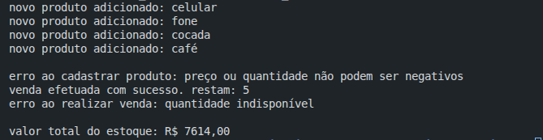

# Projeto de Avaliação

Projeto de estoque de produtos proposto na disciplina de paradigmas de linguagem de programação. O projeto consiste em um sistema de gerenciamento de estoque para avaliar o paradigma de orientação a objetos, utilizando a linguagem de programação Java.

## Informações do Projeto
- Versão Java: 21

## Print do Prompt/Terminal de logs



## Estrutura de pastas do projeto
```
├── src
│   ├── interfaces
|   |    └── IVendavel.java
|   |
│   ├── models
|   |    ├── exceptions
|   |    |   ├── EstoqueException.java
|   |    |   ├── ProductIndisponivelException.java
|   |    |   └── QuantidadeInvalidaException.java
|   |    ├── Estoque.java
|   |    ├── Product.java
|   |    ├── ProdutoComum.java
|   |    ├── ProdutoPerecivel.java
│   |    └── EstoqueApp.java
|
├── .gitignore
├── exercicio-proposto.pdf
└── README.md
```